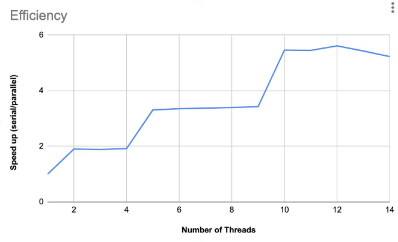

# Multithreaded Merge Sort

This project implements a multithreaded version of the
merge sort algorithm using the pthread library.

## Learning Objectives

- Take a singled threaded algorithm and safely convert it to threaded
  to see a performance gain.
- To gain more experience writing concurrent code.
- Explore the pthread library

## Make Concurrent

Convert the serial mergesort code to use multiple threads using the
pthread library. It limits the number of threads it
uses via a command line argument (for example, this could be the total
number of threads or number of levels before cutting off new thread
generation). You must get a speedup of at least 2 with 4 or more cores
to get full credit on this project.  Use n = 100,000,000 elements for
your testing.

mytests.c accepts a number of threads via a command line argument and also includes
timing results for both the serial and parallel versions of merge sort.

## Implementation Analysis

speedup.pdf analyses the following two aspects of the mergesort solution.

**Efficiency** - Analyse the thread efficiency by examining how the
threaded implementation’s performance compares to the single threaded
implementation. Include a chart showing the speedups obtained with
varying number of threads (from 1 to 8). The speedups should relative
to the serial mergesort. Please also note the number of cores on the
system that you are testing.  All tests cases should be run with 100
million elements. Please discuss whether the speedup increases
linearly as the number of threads are increased.

**Effectiveness** - Analyse the effectiveness of your threaded
implementation by comparing sorting time of your threaded solution to
the single threaded solution. Run both the serial mergesort and
threaded mergesort with elements in the range from 1,000,000 to
100,000,000, incrementing by 1M each time.  The threaded version of
merge sort should be run with 5 threads for all test cases.  Plot the
timing results in a line chart (google sheets or excel) and compare
the results. Please discuss whether the threaded version always
performs better than the serial version.

